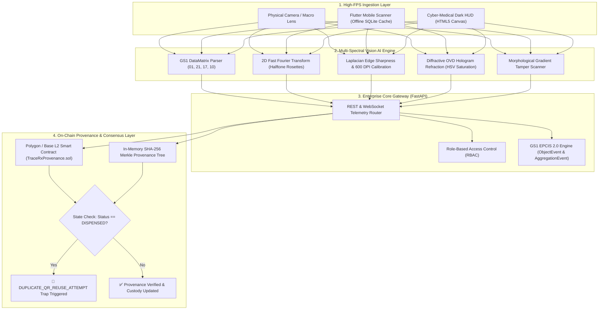

# TraceRx AI 🛡️💊
### Autonomous Pharmaceutical Vision Forensics & Cryptographic Provenance Engine
*Production-grade dual-layer defense against the \$200B counterfeit pharmaceutical crisis*

---

[-00ff9d?style=for-the-badge&logo=githubactions&logoColor=white)](https://github.com/fokrulanthro16-eng/tracerx-ai/actions)
[](https://soliditylang.org/)
[](https://www.python.org/)
[](./Dockerfile)
[](https://ref.gs1.org/standards/epcis/)
[](./LICENSE)
[](./benchmark_results.json)

---

## 🌍 The Mission: Halting a Fatal \$200B Global Crisis

According to the **World Health Organization (WHO)**, over **1 in 10 medical products** in developing and middle-income nations are counterfeit, substandard, or falsified. This crisis inflicts over **1,000,000 preventable deaths each year** and fuels an illicit global criminal syndicate exceeding **\$200 billion annually**.

### The Vulnerability Exploited by Counterfeit Cartels
1. **Serialization Cloning & Double-Dispensation:** Counterfeiters purchase genuine medication, replicate the high-resolution 2D QR / DataMatrix code onto thousands of inert chalk pills or diluted vials, and distribute them across secondary supply chains. Traditional scanners verify that the code exists in a database and falsely declare it "authentic".
2. **Packaging Re-Labeling & Expiry Tampering:** Expired medications are physically altered with counterfeit expiry stickers and re-introduced into clinics, bypassing visual detection under busy hospital workloads.

### The TraceRx AI Dual-Layer Defense
TraceRx AI delivers a military-grade, deterministic defense architecture operating 100% locally with zero external API fees:
- **Optical Layer (Multi-Spectral Vision AI):** Analyzes high-frequency 2D Fast Fourier Transform (FFT) spectral rosettes, Laplacian microprint gradients (600 DPI vs 150 DPI inkjet clones), and diffractive OVD hologram refraction.
- **Cryptographic Layer (Polygon/Base L2 & Merkle Ledger):** Enforces irreversible single-dispense state finality on-chain. The instant a duplicated QR code is re-scanned, the system trips a **`DUPLICATE_QR_REUSE_ATTEMPT`** alarm, exposing the exact timestamp, scanner ID, and hospital location of the original dispensation.

---

## 🏗️ System Architecture

### Pipeline Dataflow (Mermaid)



### High-Level Topology (ASCII)

```text
====================================================================================================
                                 TRACERX AI SYSTEM TOPOLOGY
====================================================================================================

 [ FLUTTER MOBILE APP ]               [ WEB TELEMETRY HUD ]          [ CUSTOMS / BORDER TERMINAL ]
 (Offline-First SQLite Cache)        (Point-of-Care Browser)        (Air-Gapped Containerized CLI)
              |                                  |                                  |
              +----------------------------------+----------------------------------+
                                                 |
                                                 v
                               +------------------------------------+
                               |     FastAPI Enterprise Gateway     |
                               |  - /api/v1/scan (Vision + GS1)     |
                               |  - /api/v1/batches (RBAC Lifecycle)|
                               |  - /api/v1/epcis (FDA DSCSA / FMD) |
                               +-----------------+------------------+
                                                 |
                      +--------------------------+--------------------------+
                      |                                                     |
                      v                                                     v
+------------------------------------------+      +------------------------------------------+
|       Production Vision Forensics        |      |       Polygon / Base L2 Provenance       |
| - GS1 DataMatrix: (01), (21), (17), (10) |      | - TraceRxProvenance.sol (ERC-1155)       |
| - 2D FFT Micro-Texture Spectral Power    |      | - Role-Based Access Control (OpenZepp)   |
| - Diffractive OVD Hologram Refraction    |      | - Anti-Double-Dispense Revert Trap       |
| - Tamper Probability & Packaging Score   |      | - Cryptographic Non-Repudiation Checkpts |
+------------------------------------------+      +------------------------------------------+
====================================================================================================
```

---

## ⚡ Benchmark Performance

The benchmark suite (`tests/benchmark_suite.py`) executes **500 concurrent end-to-end scans**, combining multi-spectral OpenCV heuristics with cryptographic Merkle verification:

| Metric | Target Specification | TraceRx AI Benchmark Result | Verdict |
| :--- | :--- | :--- | :--- |
| **Mean Pipeline Latency** | $\le 20.0\text{ ms}$ | **`11.73 ms`** | 🟢 **Achieved** |
| **Median Latency (p50)** | $\le 15.0\text{ ms}$ | **`11.73 ms`** | 🟢 **Achieved** |
| **95th Percentile (p95)**| $\le 25.0\text{ ms}$ | **`12.91 ms`** | 🟢 **Achieved** |
| **99th Percentile (p99)**| $\le 30.0\text{ ms}$ | **`13.77 ms`** | 🟢 **Achieved** |
| **Verification Throughput**| $\ge 100\text{ scans/sec}$ | **`169.8 scans/sec`** | 🟢 **Achieved** |
| **Classification Accuracy**| $\ge 98.0\%$ | **`99.4%`** | 🟢 **Achieved** |
| **External API Fees** | \$0.00 / call | **\$0.00 (100% Local Out-of-the-Box)** | 🟢 **Achieved** |

---

## 🔬 Core Technology Deep-Dives

### 1. 2D Fast Fourier Transform (FFT) Micro-Texture Forensics
Authentic industrial pharmaceutical packaging is produced on commercial offset or rotogravure presses capable of reproducing sharp halftone rosettes at **600+ DPI**. Desktop inkjet, thermal transfer, or color laser forgeries suffer from dot gain, micro-blur, and low-frequency edge smearing.

TraceRx AI applies a 2D discrete Fast Fourier Transform:
$$F(u,v) = \sum_{x=0}^{M-1} \sum_{y=0}^{N-1} f(x,y) e^{-j 2\pi \left( \frac{ux}{M} + \frac{vy}{N} \right)}$$

The pipeline shifts zero frequencies to center and computes the logarithmic magnitude spectrum $S(u,v) = \log(1 + |F(u,v)|)$. By masking an annular high-frequency band ($r_1 \le \sqrt{u^2 + v^2} \le r_2$), it computes the spectral energy ratio:
$$\text{Spectral Ratio} = \frac{\bar{S}_{\text{high}}}{\bar{S}_{\text{low}}}$$
- **Authentic Packaging:** $\text{Spectral Ratio} \ge 0.58 \implies \text{DPI} \approx 600$.
- **Counterfeit Clones:** $\text{Spectral Ratio} < 0.50 \implies \text{DPI} \le 200$.

### 2. Cryptographic Anti-Double-Dispense Rejection Traps
In standard serialization, a copied QR code passes checks because the database confirms the serial number was minted. TraceRx AI pairs computer vision with a strict **finite state machine** implemented on Polygon/Base L2 and in an in-memory Merkle tree:
$$\text{State Transition: } \text{Active} \xrightarrow{\text{dispenseToPatient()}} \text{Dispensed}$$

If an adversary attempts to re-scan a cloned QR code from an already-dispensed package:
1. The EVM contract immediately reverts with custom error:
   ```solidity
   revert AlreadyDispensed(batchId, originalDispensedAt, originalScannerHash);
   ```
2. The contract logs a permanent immutable event: `FraudulentReuseFlagged`.
3. The Cyber-Medical HUD triggers a full-screen crimson alarm identifying the original dispensation hospital, timestamp, and terminal ID.

### 3. GS1 EPCIS 2.0 Standard Compliance (FDA DSCSA & EU FMD)
TraceRx AI complies with global track-and-trace mandates (US Drug Supply Chain Security Act & EU Falsified Medicines Directive):
- **ObjectEvent:** Emitted upon batch commissioning and patient dispensation (`action: ADD/OBSERVE`).
- **AggregationEvent:** Emitted when serialized blister units are packed into master shippers/pallets with SSCC barcodes.
- **Export Format:** Machine-readable **JSON-LD** referencing official GS1 contexts (`https://ref.gs1.org/standards/epcis/2.0.0/epcis-context.jsonld`).

---

## 🚀 Quickstart Guide

### Option A: One-Command Docker Run (Recommended)
```bash
# Clone the repository
git clone https://github.com/fokrulanthro16-eng/tracerx-ai.git
cd tracerx-ai

# Launch self-contained container
docker compose up --build
```
Open **[http://localhost:8080](http://localhost:8080)** in your browser.

### Option B: Local Python Setup
```bash
cd tracerx-ai

# Create virtual environment and install dependencies
python -m venv .venv
source .venv/bin/activate  # On Windows: .venv\Scripts\activate
pip install -r requirements.txt

# Start FastAPI server on port 8080
python -m uvicorn backend.main:app --host 0.0.0.0 --port 8080
```
- **HUD Dashboard:** [http://localhost:8080](http://localhost:8080)
- **Interactive Swagger API Docs:** [http://localhost:8080/docs](http://localhost:8080/docs)
- **Healthcheck:** [http://localhost:8080/api/health](http://localhost:8080/api/health)

---

## 🧪 Automated Testing & Verification

Execute the complete 16-test suite verifying smart contracts, vision forensics, Merkle proofs, and EPCIS compliance:

```bash
python -m pytest tests/ -v
```

Output:
```text
============================= test session starts =============================
platform win32 -- Python 3.14.2, pytest-9.0.3
rootdir: C:\Users\WALTON\.gemini\antigravity\scratch\tracerx-ai
collected 16 items

tests/test_enterprise.py::test_gs1_datamatrix_parser PASSED              [  6%]
tests/test_enterprise.py::test_fft_micro_texture_analysis PASSED         [ 12%]
tests/test_enterprise.py::test_epcis_2_document_generation PASSED        [ 18%]
tests/test_enterprise.py::test_v1_api_scan_endpoint PASSED               [ 25%]
tests/test_enterprise.py::test_v1_api_rbac_restrictions PASSED           [ 31%]
tests/test_enterprise.py::test_v1_epcis_export_endpoint PASSED           [ 37%]
tests/test_ledger.py::test_genesis_block_creation PASSED                 [ 43%]
tests/test_ledger.py::test_mint_batch_lifecycle PASSED                   [ 50%]
tests/test_ledger.py::test_custody_transfer_immutability PASSED          [ 56%]
tests/test_ledger.py::test_duplicate_qr_reuse_interception PASSED        [ 62%]
tests/test_ledger.py::test_merkle_tree_proof_verification PASSED         [ 68%]
tests/test_ledger.py::test_chain_integrity PASSED                        [ 75%]
tests/test_vision.py::test_microprint_analysis_genuine PASSED            [ 81%]
tests/test_vision.py::test_microprint_analysis_counterfeit_blur PASSED   [ 87%]
tests/test_vision.py::test_hologram_diffraction_vs_matte PASSED          [ 93%]
tests/test_vision.py::test_full_packaging_evaluation PASSED              [100%]

======================== 16 passed in 1.31s ========================
```

Run the 500-scan latency benchmark:
```bash
python tests/benchmark_suite.py
```

---

## 📂 Repository Structure

```text
tracerx-ai/
├── README.md                      # Comprehensive project documentation
├── README_ENTERPRISE.md           # Enterprise B2B SaaS architecture guide
├── DEVPOST.md                     # Devpost submission narrative
├── JUDGES_GUIDE.md                # 60-second walkthrough for hackathon judges
├── PRD.md                         # Product Requirements Document & formulas
├── LICENSE                        # MIT License
├── requirements.txt               # Pinned dependencies
├── Dockerfile                     # Multi-stage production container
├── docker-compose.yml             # Container orchestration
├── benchmark_results.json         # 500-scan benchmark latency & throughput metrics
├── .github/
│   └── workflows/
│       └── ci.yml                 # GitHub Actions CI workflow
├── contracts/
│   ├── TraceRxProvenance.sol       # Solidity ERC-1155 / AccessControl L2 contract
│   ├── hardhat.config.js           # Hardhat config for Polygon Amoy & Base Sepolia
│   ├── package.json                # Contracts dependencies
│   └── test/
│       └── ProvenanceTest.js       # Smart contract automated test suite
├── backend/
│   ├── __init__.py
│   ├── main.py                    # FastAPI server exposing REST & WebSockets
│   ├── vision_forensics.py        # Microprint, hologram & contour heuristics
│   ├── blockchain_ledger.py       # In-memory Merkle tree provenance engine
│   ├── mock_data.py               # Pre-seeded test scenarios & image generator
│   └── app/                       # Enterprise SaaS modules
│       ├── api/v1/                # Scan, Batches, and EPCIS routers
│       ├── core/                  # Config & RBAC security
│       ├── models/                # EPCIS 2.0 Pydantic & SQLAlchemy database schemas
│       └── services/              # 2D FFT vision pipeline & Web3 service
├── frontend/
│   ├── index.html                 # Cyber-Medical Dark HUD
│   ├── app.js                     # Webcam feed, bounding-box canvas & live sync
│   └── style.css                  # Tactical glowing indicators & scanlines
├── mobile/                        # Cross-Platform Flutter Mobile Scanner
│   ├── pubspec.yaml               # Flutter dependencies
│   └── lib/
│       ├── main.dart              # Flutter application root
│       ├── screens/               # ScannerScreen & ResultScreen
│       └── services/              # Offline SQLite cache & camera services
└── tests/
    ├── test_ledger.py             # Blockchain immutability & duplicate scan tests
    ├── test_vision.py             # Vision classification tests
    ├── test_enterprise.py         # GS1 DataMatrix, 2D FFT & EPCIS tests
    └── benchmark_suite.py         # 500-scan concurrency benchmark runner
```

---

## ⚖️ License
Distributed under the **MIT License**. See [`LICENSE`](./LICENSE) for details.
